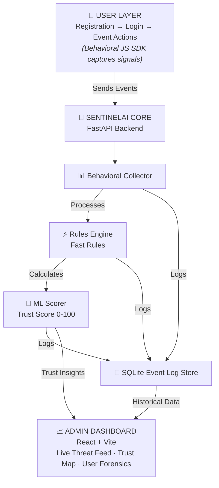

# 🛡️ SentinelAI

> **Behavioral Intelligence Platform for Campus Event Ecosystems**  
> Built for ECLearnix & All College Event — Hackathon Submission, Domain 5: Cyber Security & Forensic Science

---

## 🧠 What Is SentinelAI?

SentinelAI is an AI-powered security platform that detects fake users, bot activity, and suspicious behavior on campus event platforms — not through simple rules alone, but through **behavioral fingerprinting and a continuous trust score system**.

Every user gets a **Trust Score (0–100)** that updates in real time based on:
- How they fill forms (typing cadence, time-on-form)
- Where they log in from (geospatial drift detection)
- How fast they act (velocity analysis)
- What patterns their account matches (email pattern, device fingerprint)
- What the ML anomaly model thinks of their behavior

---

## 🔒 Security Features

| # | Feature | Description |
|---|---|---|
| 1 | **Behavioral Fingerprinting** | Tracks typing variance, mouse entropy, form-fill speed |
| 2 | **Trust Score Engine** | Continuous 0–100 score, drives adaptive auth decisions |
| 3 | **Bot Wave Detection** | Flags mass registrations in short time windows |
| 4 | **Geospatial Drift Alert** | Alerts when same account logs in from 2 countries in <2 hrs |
| 5 | **Email Pattern Analysis** | Detects sequential/disposable email patterns |
| 6 | **OTP Adaptive Auth** | OTP triggered only when trust score drops below threshold |
| 7 | **Quarantine Mode** | Suspicious users are rate-limited + monitored, not hard-banned |
| 8 | **ML Anomaly Detection** | Isolation Forest trained on behavioral feature vectors |

---

## 👥 Team

| Member | Role |
|---|---|
| **Arindam** | Tech Lead & Architect |
| **Atul** | Backend Engineer (FastAPI, Auth, DB) |
| **Akash** | Security Logic & ML Engineer |
| **Debarshi** | Frontend & Dashboard Engineer |
| **Parthiv** | DevOps, Scripts & Documentation |

---

## 🏗️ Architecture



---

## 🚀 Quick Start

### Prerequisites
- Python 3.10+
- Node.js 18+
- A Gmail account (for OTP)

### 1. Clone the repo
```bash
git clone https://github.com/YOUR_USERNAME/sentinelai.git
cd sentinelai
```

### 2. Set up environment variables
```bash
cp .env.example .env
# Fill in your values — see .env.example for details
```

### 3. Start the backend
```bash
cd backend
pip install -r requirements.txt
uvicorn main:app --reload --port 8000
```

### 4. Start the frontend
```bash
cd frontend
npm install
npm run dev
# Opens at http://localhost:5173
```

### 5. Seed the database with demo users
```bash
cd scripts
python seed_normal_users.py
```

### 6. Run the attack simulation (for demo)
```bash
python simulate_attack.py
# Watch the admin dashboard react in real time
```

---

## 🔗 Key URLs (local dev)

| Service | URL |
|---|---|
| Backend API | http://localhost:8000 |
| API Docs (Swagger) | http://localhost:8000/docs |
| Admin Dashboard | http://localhost:5173/admin |
| User Login | http://localhost:5173/login |

---

## 📁 Project Structure

```
sentinelai/
├── backend/
│   ├── main.py           # FastAPI app entrypoint
│   ├── auth.py           # JWT + OTP logic
│   ├── models.py         # SQLite table definitions
│   ├── database.py       # DB connection + helpers
│   ├── rules.py          # Security rules engine
│   ├── scorer.py         # Trust score calculator
│   ├── ml_model.py       # Isolation Forest model
│   └── geo.py            # IP geolocation wrapper
├── frontend/
│   └── src/
│       ├── dashboard/    # Admin dashboard panels
│       ├── auth/         # Login + Register pages
│       └── sdk/
│           └── behavioral.js  # Behavioral signal collector
├── scripts/
│   ├── seed_normal_users.py      # Populate DB with benign users
│   ├── simulate_attack.py        # Live demo attack scenarios
│   └── generate_training_data.py # Generate ML training CSV
├── docs/
│   └── architecture.md   # Detailed system design
├── .env.example
├── requirements.txt
├── API.md                # Full API contract
└── README.md
```

---

## 📋 Git Workflow

1. **Fork** this repository
2. **Clone** your fork locally
3. Create your feature branch: `git checkout -b feature/your-assigned-branch`
4. Commit your work: `git commit -m "feat: description of what you built"`
5. Push to your fork: `git push origin feature/your-assigned-branch`
6. Open a **Pull Request** to `main` — tag Arindam as reviewer
7. Wait for review + approval before merging

**Branch assignments:**
- `feature/backend-core` → Atul
- `feature/security-engine` → Akash
- `feature/admin-dashboard` → Debarshi
- `feature/scripts-and-docs` → Parthiv

---

## 🧪 Running Tests

```bash
cd backend
python test_scorer.py        # Tests trust score pipeline
python test_rules.py         # Tests rules engine with sample inputs
```

---

## 📄 License

MIT — Built for educational/hackathon purposes.
